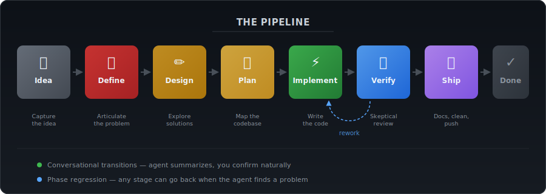
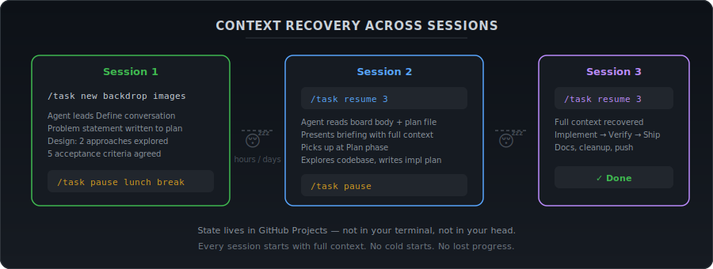
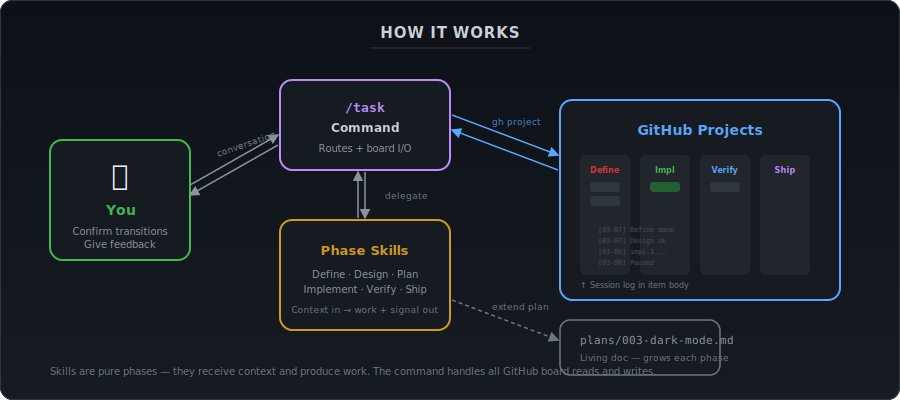

# claude-pm

**Project management for AI-assisted development.** A task pipeline for [Claude Code](https://docs.anthropic.com/en/docs/claude-code) that gives your coding agent memory, structure, and lifecycle discipline.

<p align="center">
  
</p>

## The problem

Working with an AI coding agent is powerful but chaotic:

- **No memory** — every session starts from scratch. The agent doesn't know what you discussed yesterday.
- **No overview** — you can't see which tasks are in flight, which are blocked, which are done.
- **No discipline** — work jumps from idea to code with no design review, no verification, no cleanup.
- **Constant babysitting** — you have to manually track context, remind the agent where things stand, and manage the lifecycle yourself.

## The solution

claude-pm uses **GitHub Projects as a shared state machine** between you and your coding agent. Tasks flow through a structured pipeline, and the agent can read and write its own progress — so it picks up exactly where it left off, even days later.

<p align="center">
  
</p>

**You stay in control.** The agent does the work and summarizes results. You confirm transitions conversationally — "looks good, move on" or "wait, let's reconsider the approach." No rigid approval forms, just natural conversation with clear checkpoints.

## How it works

<p align="center">
  
</p>

claude-pm has three parts:

| Component | What it does |
|-----------|-------------|
| **`/task` command** | Routes subcommands, reads/writes the GitHub Projects board, orchestrates phases |
| **Phase skills** | Six focused skills (Define, Design, Plan, Implement, Verify, Ship) that guide the agent's behavior in each stage |
| **GitHub Projects board** | Stores task state, session logs, and progress — visible to both you and the agent |

The command handles all board I/O. Skills are pure phases — they receive context and produce work. This separation means skills also work standalone outside the pipeline.

---

## Quick start

### Prerequisites

- [Claude Code](https://docs.anthropic.com/en/docs/claude-code) CLI installed
- [GitHub CLI](https://cli.github.com/) (`gh`) authenticated via `gh auth login`
- A GitHub organization or user account to host projects

### Install

```bash
git clone https://github.com/your-org/claude-pm.git ~/src/claude-pm
cd ~/src/claude-pm
./install.sh
```

This symlinks the command and skills into `~/.claude/`. To verify, open Claude Code and type `/task`.

### Set up your first project

In any git repo where you want to use the pipeline:

```
/task setup
```

This creates a GitHub Project, configures the status fields, and saves the project IDs to `~/.config/claude-pm/<repo>.taskboard.json`. One-time per repo.

---

## Usage

### Start a new task

```
/task new Improve error messages when API key is missing
```

The agent creates a board item and starts a **Define** conversation — asking questions to fully understand the problem before exploring solutions.

### See all your tasks

```
/task list
```

```
## Implement (1)
  #7  Multi-episode parser support (impl-2)
      Last: [Mar 7] Implement resumed impl-2

## Design (1)
  #6  Backdrop image support
      Last: [Mar 6] Design started — exploring 2 approaches

## Idea (2)
  #9  Series progress tracking
  #10 Dark mode toggle
```

### Resume a task

```
/task resume 7
```

The agent reads the board body and plan file, presents a briefing with full context, and picks up exactly where you left off — even if it's been days.

### Pause mid-work

```
/task pause Need to context-switch, was working on criterion 3
```

The agent saves phase-aware context (what's done, what's next, current progress) to the board body. Your note is preserved verbatim.

### Add a note

```
/task note 7 User confirmed they want retry logic, not just error messages
```

Mid-conversation, the task number is optional — the agent knows which task you're working on.

### Abandon a task

```
/task abandon 7 approach was wrong
```

Requires confirmation. Archives the board item and deletes the plan file.

### Tear down a project

```
/task teardown
```

Deletes the GitHub Project board and config file for the current repo. Shows a full inventory of what will be destroyed (item count, plan files, config path) and asks whether to include plan files. Requires you to type the exact phrase `delete it all` to confirm — anything else aborts.

---

## The pipeline

Each task flows through up to eight stages. The depth scales with the work — a one-line fix moves quickly, a new subsystem gets the full treatment.

### 1. Idea

A parking lot. Drop ideas onto the board from the GitHub UI or via `/task new`. No agent involvement until you're ready to start.

### 2. Define

The agent leads a structured conversation to **fully articulate the problem** — who's affected, what's wrong, what the boundary conditions are. No solutions yet. The output is a problem statement written to a plan file (`plans/NNN-title.md`).

### 3. Design

**Explore solutions.** The agent proposes 1-3 approaches depending on the design space, defines acceptance criteria (the checkboxes that mean "done"), and scopes the work. The plan file grows with the design.

### 4. Plan

**Map the territory.** The agent reads the actual codebase — files that will change, code that can be reused, test infrastructure that exists — and writes a concrete implementation plan with an ordered sequence of changes.

### 5. Implement

**Write the code.** The agent works through the plan autonomously — test-first, checking off criteria, reporting at natural breakpoints. It escalates to you when blocked, not when everything is fine.

Each pass has an **implementation ID** (`impl-1`, `impl-2`, ...) so rework is tracked separately.

### 6. Verify

**Skeptical review.** The agent actively looks for what's *wrong*, not confirmation that things are right. Six analysis tools available — verification run, criteria walkthrough, diff review, regression check, architecture compliance, contract compliance. It uses judgment about which matter for this change.

- Minor issues: fixed inline, re-verified
- Significant problems: new implementation ID, back to Implement, then fresh Verify
- Design-level problems: regress to an earlier phase

### 7. Ship

**Final quality gate.** Documentation updates, decision records, cleanup (debug artifacts, unused imports, temp files), and push. Uses conventional commits and automatic splitting when the diff has distinct purposes.

### 8. Done

Item archived. Plan file stays in the repo as documentation.

---

## Plan files

Plan files are living documents that grow as a task moves through the pipeline. Each phase adds its section:

```
plans/
  001-api-error-messages.md
  002-backdrop-images.md
  003-multi-episode-parser.md
```

**After Define:**
```markdown
# API Error Messages

## Problem Statement
**Who**: Developers integrating with the API
**What**: Missing API key returns a generic 500 instead of a helpful message
**Current behavior**: Opaque server error, no guidance on what's wrong
**Desired outcome**: Clear error with instructions to set the key
**Boundary**: Only covering API key — other auth errors are separate
```

**After Design** — adds Approach, Acceptance Criteria, Scope, Design Decisions.
**After Plan** — adds Implementation Plan with test strategy, ordered changes, files to modify.
**During Implement** — acceptance criteria checkboxes get checked off.

---

## Session log

Every task carries a timestamped session log in the GitHub Projects item body. This is what enables context recovery across sessions.

```markdown
## Session Log

[2026-03-06 14:30] **Define started**
[2026-03-06 14:45] **Define complete** Clear error messages for missing API key
[2026-03-06 14:50] **Design started**
[2026-03-06 15:10] **Design confirmed** Approach: custom error middleware
[2026-03-07 10:00] **Implement started** impl-1
[2026-03-07 11:30] Completed criteria 1-3
[2026-03-07 12:00] Precommit failed (unused alias) — auto-fixed
[2026-03-07 12:05] **Paused** (Implement)
Working on: criterion 4 (rate limit error formatting)
Next: add Retry-After header parsing to error middleware
```

---

## Phase regression

Any phase can go back to an earlier phase when the agent discovers something was wrong upstream. The agent flags the issue and asks what you want to do — you decide.

```
[2026-03-08 10:00] **Regressed to Design** Reason: assumed module doesn't exist,
need a different approach for error interception
```

---

## Configuration

Config is stored per repo at `~/.config/claude-pm/<repo>.taskboard.json`:

```json
{
  "project_number": 1,
  "owner": "your-org",
  "repo": "your-repo",
  "project_id": "PVT_...",
  "field_ids": {
    "status": "PVTF_...",
    "plan": "PVTF_..."
  },
  "status_option_ids": {
    "Idea": "PVTSSF_...",
    "Define": "PVTSSF_...",
    "Design": "PVTSSF_...",
    "Plan": "PVTSSF_...",
    "Implement": "PVTSSF_...",
    "Verify": "PVTSSF_...",
    "Ship": "PVTSSF_...",
    "Done": "PVTSSF_..."
  },
  "available_skills": []
}
```

`available_skills` lets you list thinking skills available in your project (e.g., language-specific or framework-specific skills). The Plan phase uses these to invoke relevant thinking before exploring code. Default is empty — add whatever skills you have installed.

---

## File structure

```
claude-pm/
  commands/
    task.md                   # Command — routing, board I/O, orchestration
  skills/
    task-define/SKILL.md      # Problem definition conversation
    task-design/SKILL.md      # Solution exploration + acceptance criteria
    task-plan/SKILL.md        # Codebase exploration + implementation planning
    task-implement/SKILL.md   # Code writing with high autonomy
    task-verify/SKILL.md      # Skeptical review + rework protocol
    task-ship/SKILL.md        # Docs, cleanup, push
  docs/
    pipeline.svg              # Pipeline stage diagram
    architecture.svg          # Architecture diagram
    session.svg               # Session recovery diagram
  install.sh                  # Symlinks into ~/.claude/
  README.md
```

---

## Design principles

**Command orchestrates, skills execute.** The `/task` command handles all GitHub Projects reads and writes. Skills receive context as input, do their work, and output a completion signal. Clean separation.

**Conversational transitions.** No `/task advance` command. The agent summarizes phase output, you confirm naturally — "looks good" or "let's revisit." Human judgment at every checkpoint.

**Living plan files.** One file per task, growing through the pipeline. Problem statement, design, implementation plan, checked-off criteria — all in one place.

**Depth scales with scope.** A one-line bug fix breezes through. A new subsystem gets full design review, careful verification, and documentation updates. The agent uses judgment.

**Skills work standalone.** Each skill can be invoked directly with a hand-crafted context block, independent of the `/task` command. Useful for one-off design sessions or verification passes.

---

## License

MIT
